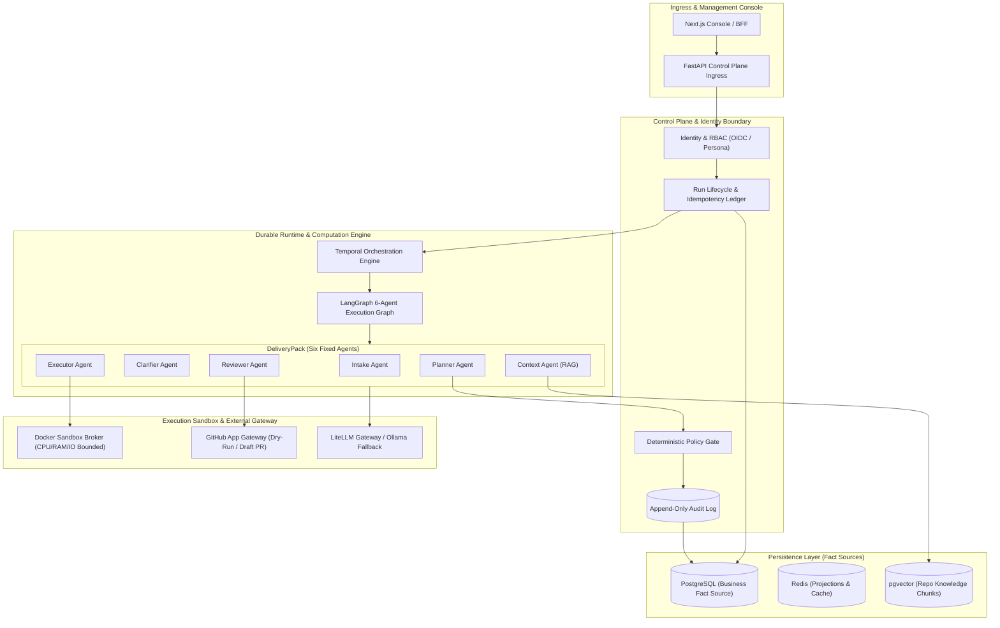

# AegisFlow

> Production-Grade Agent Control Plane for Governed Execution, Tool Authorization, Durable Workflows, and Traceable Evidence.

AegisFlow is an enterprise-grade Agent Control Plane designed to bring reliability, deterministic policy governance, human-in-the-loop (HITL) approval, evaluation, auditability, and cost control to autonomous AI agents.

While generic AI coding bots execute unconstrained side effects directly against host environments, AegisFlow introduces a strict control plane architecture where agent computations, durable workflow state, security policies, and physical tool executions are decoupled into auditable, idempotent, and resilient execution boundaries.

The platform is stress-tested through **`DeliveryPack`**—a six-agent software delivery workflow (Intake, Clarifier, Context, Planner, Executor, Reviewer) that transforms raw software requests into verified, sandbox-tested, and human-approved GitHub Pull Requests.

---

## Why AegisFlow

Deploying autonomous agents into production engineering workflows exposes critical gaps that raw LLM wrappers cannot address:

- **Nondeterministic Side Effects** — AI agents executing unconstrained shell scripts, file mutations, or git commits pose severe security and system integrity risks.
- **Transient State & Crash Loss** — Long-running agent reasoning processes lose state upon network drops, process restarts, or rate limits without durable workflow orchestration.
- **Hallucinated Evidence** — Agents declaring tasks "completed" without isolated container execution, automated unit test validation, or cryptographic artifact digests.
- **Bypassed Governance & HITL** — Lack of deterministic policy gates, role-based approval signals, or multi-tenant security boundaries.
- **Data Control & Provider Lock-in** — Mandatory cloud LLM dependencies without local-first inference fallback options (e.g., Ollama / vLLM).

---

## Product Advantages

| Dimension | AegisFlow Control Plane | Generic Coding Bots / Agent Frameworks |
| --- | --- | --- |
| **Tool Governance & Security** | Deterministic Policy Gate v0 + Contextual Policy enforcing default-deny authorization before any external side effect. | Unchecked agent tool calls or basic Regex filters running directly on host shell. |
| **Durable Workflow Runtime** | Temporal-backed workflow execution paired with LangGraph checkpoints; state survives process kills and recovers automatically. | In-memory loop or ephemeral process; process crash loses all reasoning state. |
| **Human-in-the-Loop (HITL)** | Durable `Clarification` and `Approval` signals with self-approval prevention and cryptographic action digests. | Basic CLI prompt or unmonitored execution without audit trail or role boundaries. |
| **Execution Isolation** | Ephemeral Docker Sandbox Broker with hard CPU, RAM, and network limits; secrets masked automatically. | Execution directly on developer workstation or unconstrained container host. |
| **Model Resilience & Fallback** | LiteLLM Gateway with automated circuit breakers, token usage budgets, and offline Ollama/vLLM local inference support. | Direct single-provider API binding with no circuit breaker or cost capping. |
| **Full-Stack Operations** | Next.js Developer & Reviewer Console with server-only BFF, same-origin mutation guards, and real-time step monitoring. | Terminal output or minimal raw JSON web UI with no authorization boundaries. |

---

## System Architecture

AegisFlow enforces strict separation of concerns across its modular monolith architecture. Business facts reside in PostgreSQL, workflow execution history is owned by Temporal, computational graph state is persisted in LangGraph, and Redis is limited to transient projections and caches.

### High-Level Execution Topology



### State Ownership & Trust Boundaries

| Component | Owned Responsibility | Storage Backing |
| --- | --- | --- |
| **Control Plane** | Tenants, Identity, RBAC, Policy Gates, Run Lifecycle, Idempotency Ledger, Audit Events. | PostgreSQL (`pgvector`) |
| **Workflow Engine** | Long-running workflow execution, durable signals (`Clarification`, `Approval`), retries, timeouts. | Temporal Server |
| **Agent Engine** | Computational graph state, multi-agent step transitions, reasoning checkpoints. | LangGraph (`PostgresSaver`) |
| **Gateway & Sandbox** | Ephemeral container execution, GitHub API dispatch, Model Gateway routing. | Isolated Sandbox Host |
| **Projection Layer** | Live event stream buffer, active session caches, rate-limiting counters. | Redis |

---

## Core Capabilities

### 1. DeliveryPack — Six Governed Agents
- **Intake Agent**: Standardizes raw PRDs, issues, or bug reports into validated, structured input contracts.
- **Clarifier Agent**: Detects requirement ambiguities and triggers a durable `Clarification` interrupt for human input.
- **Context Agent**: Performs deterministic repository retrieval and semantic chunking using `pgvector`.
- **Planner Agent**: Generates structured, evidence-grounded technical execution plans with explicit risk and cost budgets.
- **Executor Agent**: Applies code modifications inside an isolated Docker sandbox and executes automated build/test suites.
- **Reviewer Agent**: Evaluates patch correctness, inspects build logs, and prepares cryptographic action previews for approval.

### 2. Durable HITL Interruption & Resume
- **Clarification Loop**: Pauses workflow execution when ambiguous specifications are detected; resumes smoothly upon receiving validated answers via Temporal signals.
- **Human Approval Loop**: Requires explicit human approval for high-risk external side effects (e.g., Pull Request creation). Implements strict **self-approval prevention** to enforce separation of duties.

### 3. Policy Gate & Sandbox Isolation
- **Deterministic Policy Gate v0**: Evaluates execution intent against contextual rules before allowing physical tool execution.
- **Docker Sandbox Broker**: Runs code builds and unit tests in temporary containers with network isolation, read-only root filesystems, and strict resource quotas.
- **Cryptographic Action Previews**: Generates SHA-256 content digests for all proposed file changes prior to execution.

### 4. Developer & Reviewer Management Console
- **Next.js 16 App Router**: Full-stack management console featuring dynamic timeline monitoring, live step inspection, and interactive HITL response forms.
- **Server-Only BFF**: Enforces same-origin mutation guards (`X-AegisFlow-Mutation-Origin`) and validates Zod contracts on all API routes.
- **Dual Persona Workspaces**: Tailored interfaces for Developers (Run creation & progress tracking) and Reviewers (action previews, diff inspection, approval decisions).

### 5. Observability, Evaluation & Reliability
- **OpenTelemetry & Langfuse**: Complete LLM trace capturing latency, prompt versioning, input/output token counts, and cost metrics.
- **Prometheus & Grafana**: Real-time operational dashboards for workflow queue depth, tool failure rates, and agent step latency.
- **Golden Dataset Regression**: Automated evaluation framework benchmarking agent task success and tool-calling accuracy.

---

## Verified Engineering Evidence

AegisFlow is backed by a rigorous test suite and empirical benchmarks across all architecture layers:

```text
=========================== Short Test Summary Info ===========================
Python Backend Test Suite : 612 Passed, 37 Skipped (100% Non-External Pass)
Coverage Gate             : Passed repository fail_under = 90% threshold
Frontend Console Suite    : 23 Passed across 9 Vitest test files (100% Pass)
TypeScript Check          : Passed (0 errors via tsc --noEmit)
ESLint Code Quality       : Passed (0 warnings / 0 errors)
Next.js Production Build  : Passed (13 dynamic App Router routes compiled)
Gate 2 Reliability        : 20/20 fault runs completed, 0 duplicate side effects
Gate 3 Security Baseline  : 83 security tests passed; 0 credential leaks detected
===============================================================================
```

---

## Quick Start — Local Full-Stack Execution

Run the complete 10/10 local full-stack MVP loop using Docker Compose and Ollama without requiring external cloud model credentials or GitHub write tokens.

### Prerequisites
- Docker Desktop with Compose enabled.
- [Ollama](https://ollama.com/) running locally (`127.0.0.1:11434`) with a pulled model (e.g., `ollama pull qwen2.5:coder` or `llama3.2`).

### 1. Environment Setup
```bash
# Clone the repository
git clone https://github.com/KinguYume-G/AegisFlow.git
cd AegisFlow

# Create local environment configuration
cp .env.local-mvp.example .env.local-mvp
```

### 2. Launch Local Stack
```bash
docker compose --env-file .env.local-mvp -f compose.yaml -f compose.local-mvp.yaml up -d --build
```

### 3. Access Services
Once container health checks pass:
- **Developer / Reviewer Console**: `http://127.0.0.1:3000`
- **FastAPI Control Plane Core**: `http://127.0.0.1:8000`
- **Temporal Web UI**: `http://127.0.0.1:8088`

### 4. Teardown
```bash
docker compose --env-file .env.local-mvp -f compose.yaml -f compose.local-mvp.yaml down
```

---

## Project Repository Layout

```text
AegisFlow/
├── src/aegisflow_core/      # Core Modular Monolith
│   ├── control_plane/       # Identity, Tenants, RBAC, Run Lifecycle, Approvals, Audit
│   ├── runtime/             # Temporal Workflows & LangGraph Execution Engine
│   ├── gateway/             # Policy Gate, Sandbox Broker, GitHub App, MCP Adapters
│   ├── models/              # LiteLLM Model Gateway, Routing, Circuit Breaker
│   ├── evaluation/          # Golden Dataset, Benchmark Metrics, Regression CI
│   └── packs/delivery/      # DeliveryPack Six-Agent Implementation
├── web/console/             # Next.js Management Console & Server-Only BFF
├── tests/                   # Backend & Frontend Unit, Integration, Security, E2E Suites
├── deploy/                  # Docker Compose, Helm Charts, Keycloak & Observability Assets
├── docs/                    # Architecture Blueprint, ADRs, Design Notes & Runbooks
└── MANIFEST.md              # Engineering Inventory & File Classification
```

---

## Navigation & Governance Documentation

For contributor guidelines, architecture decisions, and detailed technical specifications:
- 🚀 [`START_HERE.md`](START_HERE.md) — Mandatory contributor onboarding entry point.
- 📐 [`docs/DESIGN_BLUEPRINT.md`](docs/DESIGN_BLUEPRINT.md) — Authoritative product and architecture blueprint.
- 🏛️ [`docs/adr/`](docs/adr/) — Accepted Architecture Decision Records (ADR-0001 through ADR-0014).
- 📜 [`AGENTS.md`](AGENTS.md) — AI agent development and collaboration constraints.
- 🗺️ [`docs/26_PRODUCTION_READINESS_PLAN.md`](docs/26_PRODUCTION_READINESS_PLAN.md) — Production readiness plan and execution roadmap.

---

## License & Security

This project is licensed under the MIT License. Security vulnerabilities or compliance disclosures should follow the policy outlined in [`SECURITY.md`](SECURITY.md).
