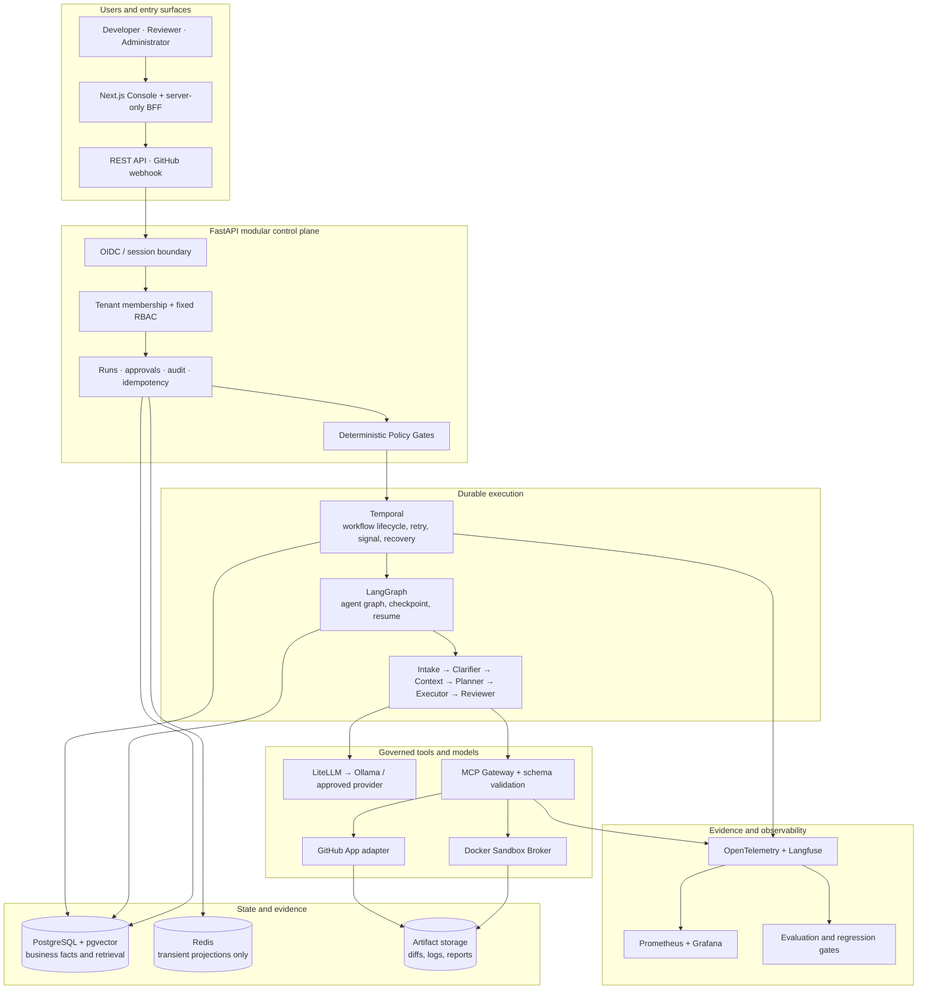

# AegisFlow

> A governed Agent Control Plane for reliable, durable, and evidence-driven software delivery.

[](https://github.com/KinguYume-G/AegisFlow/actions/workflows/ci.yml)


AegisFlow turns a PRD, GitHub Issue, or bug report into a governed software-delivery run. Six fixed agents analyze the request, recover repository context, plan the work, execute inside an isolated sandbox, review the evidence, and stop for a separate human approval before any protected external write.

The repository currently provides a verified local full-stack MVP. Production OIDC is under review in [AF-R09](https://github.com/KinguYume-G/AegisFlow/issues/119); hosted-model canaries, hardened persistence, disaster recovery, production observability, evaluation gates, and deployment certification remain explicitly tracked work. AegisFlow is therefore **not yet represented as production-certified or production-hosted**.

## Why AegisFlow

An agent that can generate code is useful. An agent that can safely participate in an enterprise delivery process also needs deterministic authorization, recoverable state, bounded execution, reviewable evidence, and a human-owned release boundary.

| Production concern | AegisFlow approach |
| --- | --- |
| Uncontrolled tool calls | Default-deny Policy Gates validate intent, parameters, tenant/repository scope, and approval before execution. |
| Lost long-running work | Temporal owns the durable workflow lifecycle; LangGraph owns the bounded agent computation state and checkpoints. |
| Hallucinated completion | Build, test, diff, risk, and action-preview evidence is persisted and reviewed instead of trusting a model claim. |
| Unsafe autonomous writes | External side effects are idempotent, auditable, and held behind a separate Human Approval step. |
| Cross-tenant leakage | PostgreSQL-backed membership and fixed RBAC remain authoritative; model output never grants permissions. |
| Model/provider failure | LiteLLM routing, budgets, retry boundaries, and a local Ollama profile separate model availability from workflow control. |

## Governed delivery loop

```mermaid
flowchart LR
    Request["PRD / Issue / Bug"] --> API["FastAPI Control Plane"]
    API --> Run["Create durable Run"]
    Run --> Temporal["Temporal workflow"]
    Temporal --> Intake
    subgraph Graph["LangGraph DeliveryPack"]
        Intake --> Clarifier --> Context --> Planner --> Gate1["Run Policy Gate"]
        Gate1 --> Executor --> Reviewer
        Reviewer -. changes requested .-> Executor
    end
    Executor --> Tools["MCP / GitHub adapter / Docker Sandbox"]
    Tools --> Evidence["Diff + Build + Test evidence"]
    Evidence --> Reviewer
    Reviewer --> Approval["Separate Human Approval"]
    Approval --> Gate2["Tool Policy Gate"]
    Gate2 --> DraftPR["GitHub Draft PR"]
    DraftPR --> Record["Trace + Cost + Evaluation + Audit"]
```



The local profile exercises this loop without a real GitHub write: it produces a governed Draft PR candidate after sandbox execution and separate approval. A real fixture-repository canary remains protected work under [AF-R12](https://github.com/KinguYume-G/AegisFlow/issues/122).

## System architecture

The following panorama is the approved production target, delivered incrementally through the status gates below. It is not evidence that every production component has already passed acceptance.

<p align="center">
  
</p>

The same boundaries are expressed below as a reviewable, version-controlled topology:



### State ownership

| Owner | Authoritative state | Explicit boundary |
| --- | --- | --- |
| PostgreSQL | Tenants, memberships, RBAC, Runs, approvals, audit, idempotency, repository versions, evaluation facts | Redis cannot become a business fact source. |
| Temporal | Workflow lifecycle, retries, timeouts, signals, compensation, worker recovery | It does not own the agent's internal computation state. |
| LangGraph | DeliveryPack node state, routing, checkpoint, resume | It does not duplicate the Temporal lifecycle. |
| Sandbox / gateways | Ephemeral execution and external API dispatch | Every write must pass policy, approval, idempotency, result validation, and audit. |
| Human reviewer | Final approval and merge decision | The LLM and the implementation agent cannot self-approve or auto-merge. |

## Core capabilities

- **Six-agent DeliveryPack** — Intake, Clarifier, Context, Planner, Executor, and Reviewer use typed contracts and conditional routing inside one fixed delivery workflow.
- **Durable Human-in-the-Loop** — clarification and approval are persisted workflow interrupts, not browser-only prompts.
- **Governed tool execution** — MCP/tool schemas, deterministic Policy Gates, tenant/repository scope, idempotency, and a side-effect ledger protect write operations.
- **Isolated verification** — the Docker Sandbox Broker applies resource, filesystem, network, timeout, and output limits before evidence is accepted.
- **Local-first model path** — the default MVP uses Ollama through the model gateway; hosted providers remain configuration-driven and separately validated.
- **Full-stack operator experience** — a Next.js App Router console exposes Run creation, step timelines, clarification, evidence, and approval through a server-only BFF.
- **Evidence over claims** — audit events, traces, token/cost records, test outputs, diffs, and approval receipts make each Run reviewable.

## Delivery status

| Scope | Status | Evidence / boundary |
| --- | --- | --- |
| Phase 0, M1–M5, Gate 4 | Accepted | Architecture, policy, runtime, sandbox, evaluation baseline, and local deployment gates are recorded in the repository. |
| AF-R04–AF-R08 local full-stack MVP | Merged | [PR #118](https://github.com/KinguYume-G/AegisFlow/pull/118) closes the loopback-only Ollama, FastAPI, Temporal, LangGraph, PostgreSQL, Redis, sandbox, and Next.js flow. |
| AF-R09 production OIDC sessions | In review | [Issue #119](https://github.com/KinguYume-G/AegisFlow/issues/119) and [PR #127](https://github.com/KinguYume-G/AegisFlow/pull/127); not complete until checks, review, and Human Merge pass. |
| AF-R10–AF-R16 production-readiness roadmap | Planned / open | Hardened persistence, Helm, real canary, replay, SLOs, evaluation release gates, staging, and controlled production deployment. |

See the [production-readiness plan](docs/26_PRODUCTION_READINESS_PLAN.md) for owner inputs, acceptance gates, and the exact difference between a local MVP and a production-certified release.

## Technology stack

| Layer | Technologies |
| --- | --- |
| Console | Next.js 16, React 19, TypeScript 5, Zod, Vitest, Playwright |
| Control plane | Python 3.12, FastAPI, Pydantic 2, SQLAlchemy 2, Alembic |
| Agent runtime | LangGraph, typed DeliveryPack contracts, PostgreSQL checkpoints |
| Durable workflow | Temporal workflows, activities, signals, retries, timeouts, compensation |
| Models and retrieval | LiteLLM, Ollama local profile, pgvector repository context |
| Tools and isolation | MCP adapters, GitHub App gateway, Docker Sandbox Broker |
| Data | PostgreSQL, pgvector, Redis projections, versioned migrations |
| Evidence | OpenTelemetry, Langfuse, Prometheus metrics, evaluation reports, audit ledger |
| Delivery | Docker Compose, Helm/k3d assets, GitHub Actions |

## Quick start: verified local MVP

### Prerequisites

- Docker Desktop with Docker Compose
- Ollama reachable from Docker and the configured model pulled (default: `qwen3:8b`)
- Ports `3000`, `3001`, `8000`, `8088`, `55432`, `56379`, and `57233` available, or overridden in the local environment file

### 1. Configure the local-only profile

```powershell
Copy-Item .env.local-mvp.example .env.local-mvp
```

Replace every `change-me-*` value in `.env.local-mvp`. These values are for development only and must never be reused in production.

### 2. Start the stack

```powershell
docker compose --env-file .env.local-mvp -f compose.yaml -f compose.local-mvp.yaml up -d --build
```

### 3. Open the services

- Developer Console: `http://127.0.0.1:3000`
- Reviewer Console: `http://127.0.0.1:3001`
- FastAPI: `http://127.0.0.1:8000`
- Temporal Web: `http://127.0.0.1:8088`

Follow the reproducible acceptance path in [`docs/reports/LOCAL_MVP_RUNBOOK.md`](docs/reports/LOCAL_MVP_RUNBOOK.md). The local profile is deliberately loopback-only, uses development personas, and keeps GitHub in dry-run mode.

### 4. Stop the stack

```powershell
docker compose --env-file .env.local-mvp -f compose.yaml -f compose.local-mvp.yaml down
```

## Repository layout

```text
AegisFlow/
├── src/aegisflow_core/       FastAPI modular monolith and application core
│   ├── control_plane/        Identity, tenancy, RBAC, Runs, approvals, audit
│   ├── runtime/              Temporal workflows and LangGraph checkpoints
│   ├── gateway/              Policy, MCP, GitHub, sandbox, side-effect controls
│   ├── models/               LiteLLM routing, budgets, circuit breakers
│   ├── evaluation/           Datasets, metrics, regression evidence
│   └── packs/delivery/       Six fixed DeliveryPack agents
├── web/console/              Next.js management console and server-only BFF
├── tests/                    Unit, component, integration, security, E2E, load
├── deploy/                   Helm, k3d, Keycloak, dashboards, deployment assets
├── scripts/                  Reproducible smoke, fault, evaluation, and ops tools
├── docs/                     Architecture, ADRs, plans, runbooks, reports
├── project/                  Canonical GitHub bootstrap data
└── archive/                  Historical material; never an active fact source
```

## Verification

```powershell
# Backend and architecture contracts
uv run pytest -q -p no:cacheprovider

# Frontend quality gates
npm.cmd --prefix web/console run test:run
npm.cmd --prefix web/console run typecheck
npm.cmd --prefix web/console run lint
npm.cmd --prefix web/console run build

# Compose and patch hygiene
docker compose --env-file .env.local-mvp.example -f compose.yaml -f compose.local-mvp.yaml config --quiet
docker compose --env-file .env.oidc-dev.example -f compose.yaml -f compose.oidc-dev.yaml config --quiet
git diff --check
```

Protected database, Temporal, Docker, browser, hosted-model, and real-GitHub tests require their documented services and authorization. CI and PR evidence—not README claims—are the source of truth for a particular revision.

## Engineering governance

AegisFlow intentionally uses a modular monolith and one governed delivery workflow. It does not introduce Kafka, Terraform, CrewAI, generic ABAC, automatic merge, automatic production deployment, a visual Workflow Builder, or autonomous policy decisions.

Start with [`START_HERE.md`](START_HERE.md), then read:

- [`docs/DESIGN_BLUEPRINT.md`](docs/DESIGN_BLUEPRINT.md) — authoritative product and architecture blueprint
- [`docs/02_ARCHITECTURE.md`](docs/02_ARCHITECTURE.md) — containers, modules, state ownership, and trust boundaries
- [`docs/adr/`](docs/adr/) — accepted architecture decisions
- [`docs/21_TRACEABILITY_MATRIX.md`](docs/21_TRACEABILITY_MATRIX.md) — requirement-to-evidence mapping
- [`AGENTS.md`](AGENTS.md) — mandatory human/AI development protocol
- [`SECURITY.md`](SECURITY.md) — vulnerability reporting and security expectations

## License

No open-source license has been declared. All rights are reserved by the repository owner unless a license is added later.
