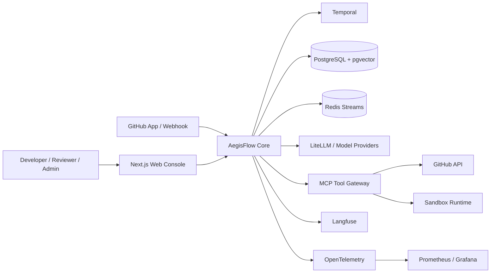
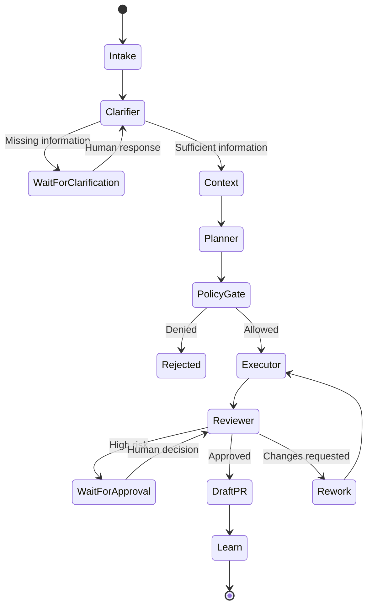

# 02 — Architecture

## 架构目标

采用模块化单体，以最小复杂度证明可靠执行、状态恢复、幂等、工具治理、审批、评测、可观测性、成本控制和多租户隔离。

## System Context



## Containers

| Container | 责任 |
|---|---|
| Next.js Console | Runs、Traces、Evals、Approvals、Cost、只读状态图 |
| AegisFlow Core | Control Plane、Runtime、Gateway、Models、Evaluation、DeliveryPack |
| Temporal Worker | 长流程、Signal、Retry、Timeout、Saga、恢复 |
| PostgreSQL + pgvector | 业务事实、版本、审批、审计、知识数据 |
| Redis Streams | Web 实时事件和轻量通知，不拥有业务事实 |
| Sandbox | 受控改码和测试 |
| Langfuse | LLM Trace、Prompt、Token、Agent Eval |
| OTel + Prometheus/Grafana | 系统 Trace、Metrics、Logs 和 Dashboard |

## Modular Monolith

```text
aegisflow_core/
├── control_plane/
│   ├── tenants
│   ├── identity
│   ├── rbac
│   ├── registries
│   ├── approvals
│   └── audit
├── runtime/
│   ├── graph
│   ├── state
│   ├── memory
│   ├── checkpoint
│   └── context
├── gateway/
│   ├── mcp
│   ├── policy
│   ├── sandbox
│   └── github
├── models/
│   ├── routing
│   ├── circuit_breaker
│   └── cost
├── evaluation/
│   ├── datasets
│   ├── runners
│   ├── metrics
│   └── regression
└── packs/
    └── delivery/
        ├── intake
        ├── clarifier
        ├── context
        ├── planner
        ├── executor
        └── reviewer
```

当前文档只定义边界，不提供业务实现。

## DeliveryPack Runtime



## 六 Agent 契约

| Agent | 输入 | 输出 | 主要副作用 |
|---|---|---|---|
| Intake | PRD / Bug / Issue | 标准化 Request | 无 |
| Clarifier | Request | 缺失信息或确认后的 Request | HITL |
| Context | Request | 引用化 Context Package | 读取知识源 |
| Planner | Request + Context | Plan、Risk、Budget | 无 |
| Executor | Approved Plan | Patch、Test Result、Evidence | Sandbox、Branch |
| Reviewer | Plan + Evidence | Decision、Findings、Approval Need | Draft PR |

实现时允许 Agent 内部使用确定性函数，但对外契约保持六个命名 Agent。

## LangGraph / Temporal Boundary

### LangGraph

- Agent 内部节点状态
- 条件路由
- Reviewer 汇总
- Checkpoint
- 节点级重放
- Memory / Context

### Temporal

- 业务流程生命周期
- 等待澄清、审批和 CI
- 外部副作用 Activity
- Retry / Timeout
- Saga
- Worker 恢复

### 判断阈值

存在外部副作用、等待超过分钟级、失败成本高、需要跨进程恢复或持久 Signal 时使用 Temporal，否则 LangGraph 单层足够。

## State Ownership

| 状态 | 唯一所有者 | 持久位置 |
|---|---|---|
| Workflow 生命周期 | Temporal | Event History |
| 等待澄清/审批/CI | Temporal | Event History + PostgreSQL 投影 |
| Agent 图状态 | LangGraph | PostgresSaver |
| Tenant、RBAC、版本、审批事实 | Core Domain | PostgreSQL |
| 幂等记录 | Gateway / Workflow | PostgreSQL |
| 实时 UI 事件 | Presentation | Redis Streams |
| LLM Trace | Observability | Langfuse |
| 系统 Trace | Observability | OTel Backend |
| 文件工作区 | Sandbox | 临时存储 |

铁律：PostgreSQL 保存业务事实，Temporal 保存业务执行历史，LangGraph 保存 Agent 计算状态，Redis 不作为最终事实来源。

## Idempotency Contract

外部副作用键至少包含：

```text
tenant_id
run_id
step_id
tool_name
canonical_arguments_hash
```

GitHub 写操作还写入 AegisFlow Marker，同时检查本地 Ledger 和远端资源。

## Trust Boundaries

1. Browser ↔ Core
2. GitHub Webhook ↔ Core
3. Core ↔ Model Provider
4. Core ↔ MCP Tool
5. Core ↔ Sandbox
6. Tenant A ↔ Tenant B
7. Prompt / RAG ↔ Policy Engine
8. AI Output ↔ External Side Effect

每个边界都要求身份、输入校验、授权、审计和失败处理。

## Data Principles

- tenant-owned 表带 `tenant_id`
- 版本不可原地覆盖
- 审计只追加
- Secret 只保存引用
- RAG 文档视为不可信输入
- 删除策略保留必要审计证据

## Deployment Evolution

Development 使用 Docker Compose；Demo 使用 k3s + Helm。微服务拆分、新消息队列、新 Agent、新应用包、新持久化系统和状态所有权变化必须 ADR。
